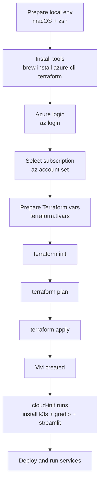
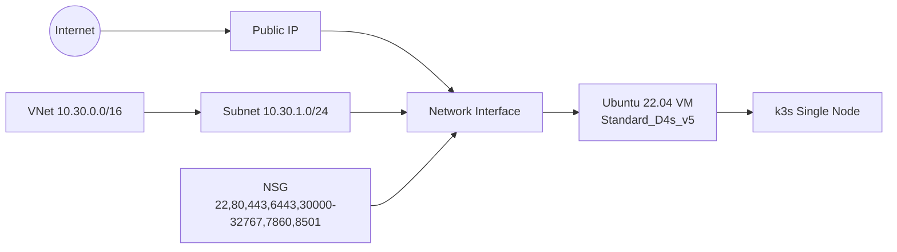

# Terraform Workflow Guide

This guide provides a detailed walkthrough of using Terraform to deploy and manage Azure infrastructure. It's designed for readers new to Terraform.

## Table of Contents

1. [Understanding the Workflow](#1-understanding-the-workflow)
2. [Infrastructure Architecture](#2-infrastructure-architecture)
3. [Prerequisites Setup](#3-prerequisites-setup)
4. [Terraform Basics](#4-terraform-basics)
5. [Step-by-Step Deployment](#5-step-by-step-deployment)
6. [Post-Deployment Verification](#6-post-deployment-verification)
7. [Common Operations](#7-common-operations)
8. [Troubleshooting](#8-troubleshooting)
9. [Best Practices](#9-best-practices)

---

## 1) Understanding the Workflow

This diagram shows the complete flow from setup to deployment:



### Workflow Phases Explained

| Phase | What Happens | Why It Matters |
|-------|-------------|----------------|
| **Setup** | Install Azure CLI & Terraform | One-time setup on your machine |
| **Authenticate** | `az login` connects to Azure | Terraform needs permission to create resources |
| **Configure** | Create `terraform.tfvars` | Define your specific settings (SSH key, IP ranges) |
| **Initialize** | `terraform init` downloads providers | Prepares Terraform to talk to Azure |
| **Plan** | `terraform plan` previews changes | See what will be created **before** it happens |
| **Apply** | `terraform apply` creates resources | Actual infrastructure creation in Azure |
| **Bootstrap** | cloud-init installs k3s | Automated VM configuration on first boot |

## 2) Infrastructure Architecture

This diagram shows the Azure resources Terraform creates:



### Resource Breakdown

| Resource | Type | Purpose |
|----------|------|---------|
| **Resource Group** | Container | Logical grouping for all resources |
| **VNet** | Network | Virtual network (10.30.0.0/16) |
| **Subnet** | Network | Subnet within VNet (10.30.1.0/24) |
| **Public IP** | Network | Static IP for external access |
| **Network Interface** | Network | Connects VM to subnet |
| **Network Security Group** | Security | Firewall rules (SSH, HTTP, k3s, etc.) |
| **VM** | Compute | Ubuntu 22.04 with 4 vCPU / 16GB RAM |
| **Managed Disk** | Storage | OS disk with Premium SSD |

---

## 3) Prerequisites Setup

### 3.1 Install Required Tools

```bash
# Install Azure CLI (macOS)
brew install azure-cli

# Install Terraform
brew install terraform

# Verify installations
az --version
terraform --version
```

### 3.2 Generate SSH Key (if needed)

```bash
# Check if you have a key
ls ~/.ssh/id_rsa.pub

# If not, generate one
ssh-keygen -t ed25519 -C "azure-k3s"
```

### 3.3 Authenticate with Azure

```bash
# Login (opens browser)
az login

# List your subscriptions
az account list --output table

# Set active subscription (if you have multiple)
az account set --subscription "<SUBSCRIPTION_NAME_OR_ID>"

# Verify current subscription
az account show --output table
```

---

## 4) Terraform Basics

### What is Terraform State?

Terraform keeps track of your infrastructure in a **state file** (`terraform.tfstate`). This file maps your configuration to real resources in Azure.

⚠️ **Important**: The state file contains sensitive data. Never commit it to Git! (Already in `.gitignore`)

### Core Terraform Commands

| Command | Purpose | When to Use |
|---------|---------|-------------|
| `terraform init` | Initialize working directory | First time, or after adding new providers |
| `terraform fmt` | Format code to standard style | Before committing changes |
| `terraform validate` | Check syntax errors | After editing `.tf` files |
| `terraform plan` | Preview changes | Before every apply |
| `terraform apply` | Create/update infrastructure | When you're ready to deploy |
| `terraform destroy` | Delete all resources | When cleaning up |
| `terraform output` | Show output values | To get IP addresses, etc. |

### The Terraform Lifecycle

1. **Write** configuration in `.tf` files
2. **Initialize** to download providers
3. **Plan** to see what will change
4. **Apply** to make it happen
5. **Manage** resources over time
6. **Destroy** when done

---

## 5) Step-by-Step Deployment

### Option A: Using the Automated Script (Recommended)

```bash
# Ensure you've run az login first
az login

# Deploy everything
cd /Users/gichanlee/workspace/azure_infra
./scripts/deploy.sh
```

**What the script does:**
1. Checks for SSH key
2. Runs `terraform init`
3. Formats and validates code
4. Creates a plan
5. Applies the plan
6. Shows outputs

### Option B: Manual Step-by-Step

#### Step 1: Prepare Configuration

```bash
cd /Users/gichanlee/workspace/azure_infra/terraform

# Copy example configuration
cp terraform.tfvars.example terraform.tfvars

# Edit with your values
nano terraform.tfvars
```

**Required changes in `terraform.tfvars`:**
- `ssh_public_key`: Your SSH public key content
- `k3s_api_allowed_cidr`: Your IP address + `/32` (for security)

#### Step 2: Initialize Terraform

```bash
terraform init
```

**What happens:**
- Downloads Azure provider plugin
- Creates `.terraform/` directory
- Initializes backend (state storage)

**Expected output:**
```
Initializing provider plugins...
- Finding latest version of hashicorp/azurerm...
- Installing hashicorp/azurerm v3.x.x...

Terraform has been successfully initialized!
```

#### Step 3: Format and Validate

```bash
# Format code to standard style
terraform fmt -recursive

# Check for syntax errors
terraform validate
```

#### Step 4: Create Execution Plan

```bash
terraform plan -out tfplan
```

**What to look for:**
- Green `+` = resources to be created
- Red `-` = resources to be destroyed
- Yellow `~` = resources to be modified

Review the plan carefully! It shows exactly what Terraform will do.

#### Step 5: Apply Changes

```bash
terraform apply tfplan
```

This creates the infrastructure in Azure. It typically takes 3-5 minutes.

**Progress indicators:**
```
azurerm_resource_group.main: Creating...
azurerm_virtual_network.main: Creating...
azurerm_public_ip.main: Creating...
...
Apply complete! Resources: 8 added, 0 changed, 0 destroyed.
```

#### Step 6: View Outputs

```bash
terraform output
```

**Example output:**
```
public_ip = "20.123.45.67"
vm_name = "k3s-vm"
ssh_command = "ssh azureuser@20.123.45.67"
```

---

## 6) Post-Deployment Verification

### 6.1 Wait for Cloud-Init to Complete

The VM needs 2-5 minutes after creation to install k3s and tools.

```bash
# SSH into the VM
ssh azureuser@<PUBLIC_IP>

# Check cloud-init status
cloud-init status

# Expected output when complete:
# status: done
```

### 6.2 Verify k3s Installation

```bash
# Check k3s node status
sudo kubectl get nodes -o wide

# Check system pods
sudo kubectl get pods -A

# Check k3s service
sudo systemctl status k3s
```

### 6.3 Verify Python Tools

```bash
# Check installed tools
pip3 list | grep -E "(gradio|streamlit)"

# Check Python version
python3 --version
```

---

## 7) Common Operations

### 7.1 Viewing Current State

```bash
# Show all resources
terraform state list

# Show details of a specific resource
terraform state show azurerm_linux_virtual_machine.main

# Show outputs
terraform output
```

### 7.2 Making Changes

1. Edit `.tf` files or `terraform.tfvars`
2. Run `terraform plan` to preview
3. Run `terraform apply` to update

**Example: Change VM size**
```bash
# Edit terraform.tfvars
vm_size = "Standard_D8s_v5"  # upgrade to 8 vCPU

# Preview the change
terraform plan

# Apply the change
terraform apply
```

### 7.3 Destroying Resources

```bash
# Preview what will be deleted
terraform plan -destroy

# Delete everything (requires confirmation)
terraform destroy

# Or use the script
./scripts/destroy.sh
```

⚠️ **Warning**: `terraform destroy` deletes **all** resources managed by this Terraform configuration!

---

## 8) Troubleshooting

### Common Issues and Solutions

#### Issue: "Error: subscription not specified"

**Solution:**
```bash
az account set --subscription "<YOUR_SUBSCRIPTION_ID>"
```

#### Issue: "Error: Provider registry.terraform.io/hashicorp/azurerm locked"

**Solution:**
```bash
rm -f .terraform.tfstate.lock.info
terraform apply
```

#### Issue: SSH key authentication fails

**Solution:**
```bash
# Verify key format
cat ~/.ssh/id_rsa.pub

# Should start with: ssh-rsa or ssh-ed25519
# Update terraform.tfvars with the full key content
```

#### Issue: Cloud-init hasn't finished

**Solution:**
```bash
# SSH to VM and check logs
ssh azureuser@<PUBLIC_IP>
sudo tail -f /var/log/cloud-init-output.log

# Wait for "Cloud-init v. XX.X finished"
```

#### Issue: Can't access k3s API

**Solution:**
```bash
# Check your IP is allowed in NSG
curl https://ifconfig.me

# Update terraform.tfvars
k3s_api_allowed_cidr = "<YOUR_IP>/32"

# Apply changes
terraform apply
```

---

## 9) Best Practices

### Security

✅ **DO:**
- Limit SSH/k3s access to your IP (`/32`)
- Use strong SSH keys (ed25519)
- Review plans before applying
- Keep Terraform version updated

❌ **DON'T:**
- Don't commit `terraform.tfvars` or `.tfstate` files
- Don't use `0.0.0.0/0` for production
- Don't share state files (contain credentials)
- Don't manually modify Azure resources managed by Terraform

### Cost Management

💰 **Tips to save money:**
- Destroy resources when not in use (`terraform destroy`)
- Use smaller VM sizes for testing
- Set up Azure Cost Alerts
- Review Azure billing regularly

**Estimated costs** (East US region):
- `Standard_D4s_v5`: ~$140/month
- `Standard_D8s_v5`: ~$280/month
- Public IP: ~$3/month
- Storage: ~$10-20/month

### Workflow Tips

1. **Always run `terraform plan` first** - Never skip this step!
2. **Use version control** - Commit `.tf` files to Git
3. **Document changes** - Add comments in code
4. **Test in stages** - Use `terraform plan -target=<resource>` for specific resources
5. **Keep it DRY** - Use variables and modules to avoid repetition

### State Management

**Local State** (current setup):
- State file stored locally in `terraform.tfstate`
- Good for: Single user, learning, testing
- Risk: File loss means losing track of resources

**Remote State** (production recommendation):
- Store state in Azure Blob Storage or Terraform Cloud
- Good for: Teams, production, CI/CD
- Benefits: State locking, versioning, collaboration

---

## Next Steps

Now that you understand the workflow:

1. ✅ Try deploying the infrastructure
2. ✅ Make a small change (e.g., VM name) and apply it
3. ✅ Practice destroying and recreating
4. 📚 Learn more: [Terraform Azure Provider Docs](https://registry.terraform.io/providers/hashicorp/azurerm/latest/docs)
5. 🚀 Explore advanced topics: modules, remote state, workspaces

---

## Quick Reference Card

```bash
# First-time setup
az login
cd /Users/gichanlee/workspace/azure_infra
./scripts/deploy.sh

# Make changes
# 1. Edit .tf files or terraform.tfvars
terraform plan          # Preview
terraform apply         # Apply

# Get info
terraform output        # Show outputs
terraform state list    # List resources

# Clean up
terraform destroy       # Delete everything
# or
./scripts/destroy.sh
```

---

**Questions or issues?** Review the troubleshooting section or check [Terraform documentation](https://www.terraform.io/docs).
