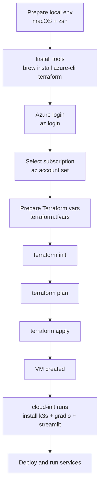
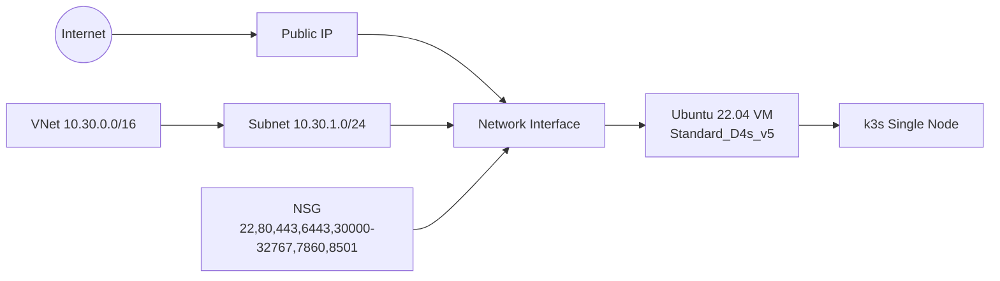

# Workflow (Azure CLI + Terraform)

## 1) Full Flow



## 2) Infrastructure



## 3) Current TODO

- [x] Install Azure CLI
- [x] Install Terraform
- [x] Write Terraform code (Azure VM + network + NSG)
- [x] Add cloud-init for k3s bootstrap
- [x] Add docs + Mermaid diagrams
- [ ] Run `az login` (user step)
- [ ] Run real `terraform apply`

## 4) Directory Structure

```text
azure_infra/
├── .gitignore
├── README.md
├── WORKFLOW.md
└── terraform/
    ├── main.tf
    ├── variables.tf
    ├── outputs.tf
    ├── terraform.tfvars.example
    └── cloud-init/
        └── k3s-init.yaml
```

## 5) Run Steps

### 5-1. Azure login (user step)

```bash
az login
az account list --output table
az account set --subscription "<SUBSCRIPTION_NAME_OR_ID>"
```

### 5-2. Prepare Terraform variables

```bash
cd /Users/gichanlee/workspace/azure_infra/terraform
cp terraform.tfvars.example terraform.tfvars
```

Update at least these values in `terraform.tfvars`:
- `ssh_public_key`
- `k3s_api_allowed_cidr` (recommended: your public IP `/32`)

### 5-3. Deploy

```bash
terraform init
terraform plan -out tfplan
terraform apply tfplan
```

## 6) Check After Deploy

```bash
terraform output
ssh azureuser@<PUBLIC_IP>
sudo kubectl get nodes -o wide
sudo kubectl get pods -A
```

## 7) Performance Guide (k3s + ~5 web services)

- Recommended VM: `Standard_D4s_v5`
- Disk: `Premium_LRS` with 128GB+
- If load grows, scale up to `Standard_D8s_v5`
- For production, prefer Ingress + TLS over many open ports

## 8) Cost and Security Notes

- Do not keep `k3s_api_allowed_cidr` as `0.0.0.0/0`; limit to your IP
- For long-term use, close direct `7860`/`8501` access and route via Ingress
- To stop costs when done:

```bash
terraform destroy
```
